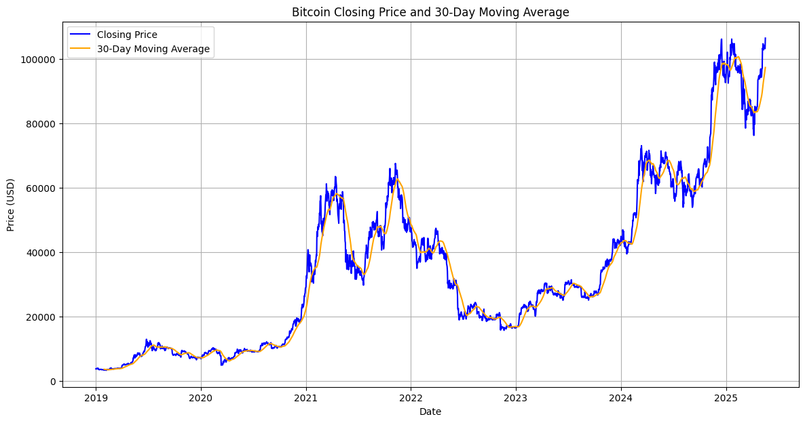
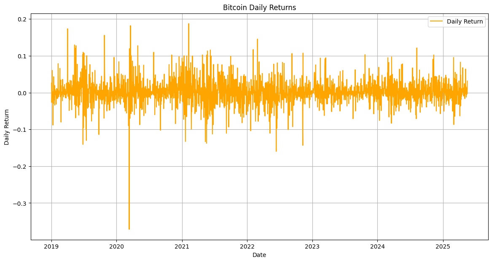
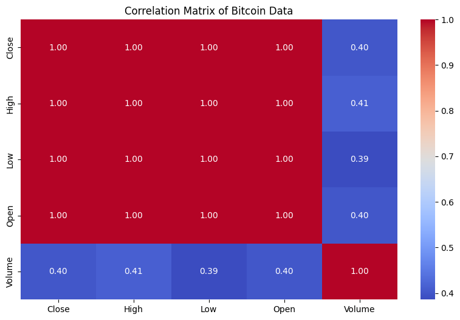
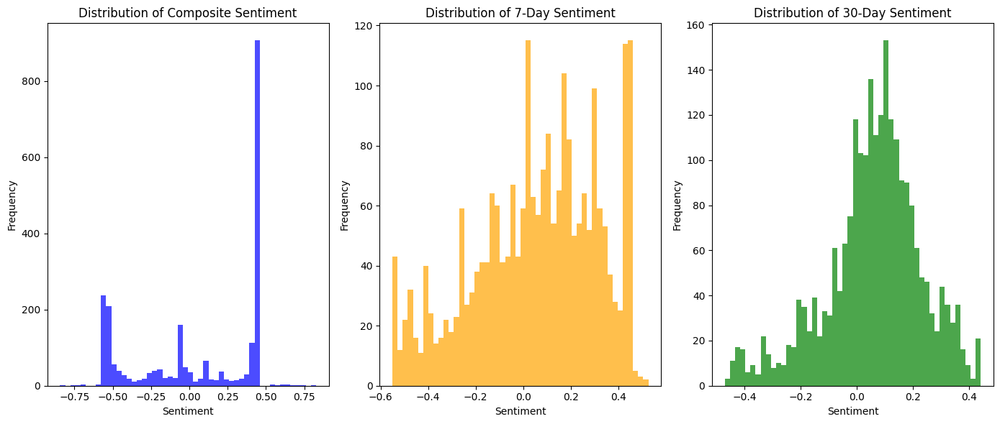
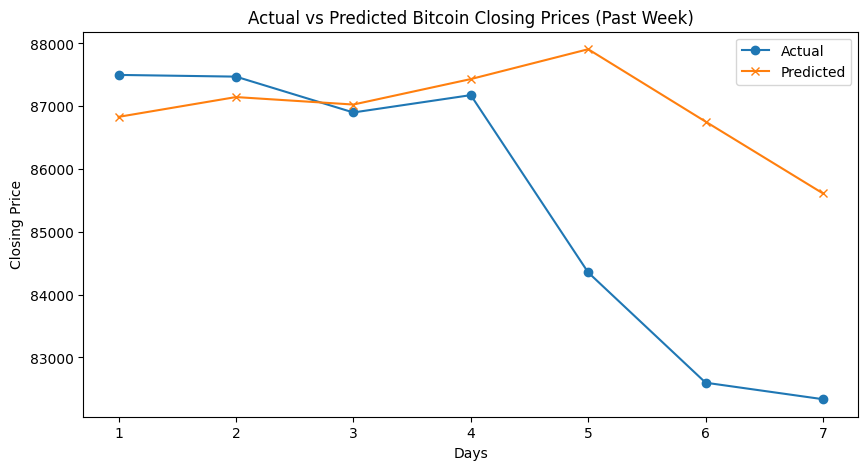

# 📊 Bitcoin Price Prediction Using Sentiment & Machine Learning

## 👥 Team Members
- Alekhya Tentu
- Vaishnavi Ratheesh Nair
- Adarsh Rao Akula

---

## 📘 Project Overview

This project aims to predict Bitcoin's **daily price direction (⬆️/⬇️)** and **next-day closing value** by combining technical indicators with sentiment signals extracted from **Wikipedia edits** and **Guardian news articles**.  
We implemented both **classification** (direction) and **regression** (price) models using **XGBoost** and **LSTM** to capture different market dynamics.

---

## 📂 Project Structure

| Folder            | Description                                     |
|-------------------|-------------------------------------------------|
| `notebooks/`      | Jupyter notebook for EDA and modeling           |
| `data/`           | Cleaned and merged datasets                     |
| `src/`            | Scripts for modeling and feature engineering    |
| `Visualization/`  | Uploaded charts and visualizations              |

---

## 🔗 Data Sources

- 📈 **Bitcoin OHLCV Data** – Yahoo Finance (2019–2024)
- 📰 **Guardian Articles** – ~250 articles via Guardian Open API
- 📝 **Wikipedia Edits** – ~1200 records scraped using the MediaWiki API

All datasets were time-aligned and cleaned to ensure consistency across sentiment and price signals.

---

## 🔄 Process Flow

### 1️⃣ Data Cleaning & Preprocessing
- Merged datasets on a daily index
- Forward-filled missing values
- Preprocessed text for sentiment analysis

---

### 2️⃣ Exploratory Data Analysis (EDA)

#### 📉 Bitcoin Price + 30-Day SMA  


#### 📊 Daily Returns Distribution  


#### 🔥 Feature Correlation Heatmap  


*Lag features like `Close_t-1` had nearly perfect correlation with `tomorrow_price`, motivating their use in modeling.*

---

### 3️⃣ Sentiment Analysis

We extracted sentiment using:
- **VADER** for Wikipedia edit summaries  
- **BERT** for Guardian news articles

Derived features included:
- Composite sentiment score  
- Rolling 7-day and 30-day averages  
- Sentiment momentum (`s7 - s30`)

#### 💬 Sentiment Feature Distributions  


---

### 4️⃣ Feature Engineering

We created the following features:
- Lagged prices: `Close_t-1`, `Close_t-7`
- Technical indicators: RSI, MACD, Bollinger Bands
- Sentiment momentum & interaction terms: `sentiment_7day × RSI_14`

---

### 5️⃣ Modeling

| Model        | Task                   | Output             |
|--------------|------------------------|--------------------|
| XGBoost      | Classification (⬆️/⬇️) | Price Direction    |
| LSTM         | Regression              | Next-Day Price     |

- Addressed imbalance with **SMOTE**  
- 80/20 train-test split with 5-fold CV  
- MinMax scaling applied for LSTM

---

## 📈 Model Evaluation

### ✅ XGBoost Classifier
- Accuracy: **62%**
- Recall (UP): **0.67**
- F1 Score (UP): **0.53**

### 📉 LSTM Regressor
- RMSE: **~78,000**
- Captured trend momentum but underperformed due to price volatility

#### 🎯 Actual vs Predicted Price  


---

## 🚀 How to Run the Project

```bash
# Clone the repository
git clone https://github.com/AlekhyaTentu/Bitcoin-Prediction-Project.git
cd Bitcoin-Prediction-Project

# Install required libraries
pip install -r requirements.txt

# Launch the notebook
jupyter notebook notebooks/final_model_pipeline.ipynb
